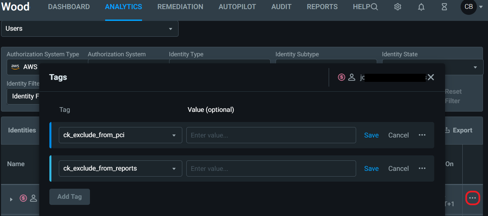

# Getting started with Entra Permissions Management (EPM)
:warning: Please [double check the official documentation page(s)](https://learn.microsoft.com/en-us/azure/active-directory/cloud-infrastructure-entitlement-management/onboard-enable-tenant), as the product is in rapid development and changes are frequent.

:page_facing_up:This hackathon will, for most attendees, require the use of an EPM trial and we have an official guide available for you [here](https://learn.microsoft.com/en-us/azure/active-directory/cloud-infrastructure-entitlement-management/permissions-management-trial-user-guide).

Aside from an overview of EPM, hackathon participants will be carrying out a number of activities. Here are some relevant documentation page links to help you complete your tasks:
1. [Sign up to the EPM Trial (if required)](https://aka.ms/TryPermissionsManagement)
2. [Enable EPM in your organisation](https://learn.microsoft.com/en-us/azure/active-directory/cloud-infrastructure-entitlement-management/onboard-enable-tenant)
3. [Onboard an AWS account](https://learn.microsoft.com/en-us/azure/active-directory/cloud-infrastructure-entitlement-management/onboard-aws)
4. [Onboard an Azure subscription](https://learn.microsoft.com/en-us/azure/active-directory/cloud-infrastructure-entitlement-management/onboard-azure)
5. [Permissions on Demand](https://learn.microsoft.com/en-us/azure/active-directory/cloud-infrastructure-entitlement-management/how-to-create-approve-privilege-request)
6. [Just enough access poilcy creation / Creating a role](https://learn.microsoft.com/en-us/azure/active-directory/cloud-infrastructure-entitlement-management/how-to-create-role-policy)
7. [Rightsize permissions](https://learn.microsoft.com/en-us/azure/active-directory/cloud-infrastructure-entitlement-management/how-to-add-remove-role-task)
8. [Create an alert](https://learn.microsoft.com/en-us/azure/active-directory/cloud-infrastructure-entitlement-management/how-to-create-alert-trigger)

# Common Entra Permissions Management (EPM) Procedures
There are a number of procedures that you will use frequently when managing EPM.
## Procedure: Remove a role from an identity
### Azure and GCP
*For user, group, application, or managed identity.*

This will remove the role from the identity in the Azure/GCP portal immediately.  The change will be reflected by EPM within 4 hours, unless you trigger the data collection sooner.


1. Navigate to Remediation > Permissions > Filter by:
```Auth System Type: Azure or GCP
Auth System: all (or choose a specific one)
Search For: user, group, application, or managed identity
User Status: Active,
PCI: i.e. High, 
Task Usage: Any
```
> Click Apply

2. Select identity
3. Select the role/s that are to be removed
4. Select Remove Role
5. Select role from Available Roles
6. Submit

### AWS
*For user, group, or role.*

This will remove the role/policy from the identity in the AWS portal immediately.  The change will be reflected by EPM within 4 hours, unless you trigger the data collection sooner.


1. Navigate to Remediation > Permissions > Filter by:
```Auth System Type: AWS
Auth System: all (or choose a specific one), 
Search For: user, group, or role
User Status: Active,
PCI: i.e. High, 
Task Usage: Any
```
> Click Apply
2. Select identity
3. Select Detach Policies
4. Select policies from Available Policies
5. Submit


## Procedure: Assign Read-Only Status
### Azure and GCP
*For user, group, application, managed identity*

This will remove the directly assigned roles from the identity in the Azure/GCP portal immediately.  The change will be reflected by EPM within 4 hours, unless you trigger the data collection sooner.
1. Navigate to Remediation > Permissions > Filter by:
```
Auth System Type: Azure or GCP
Auth System: all, 
Search For: user, group, application, managed identity
User Status: Active,
PCI: High, 
Task Usage: Any
```
> Click Apply
2. Select identity
3. Select the directly assigned role/s 
4. Select Assign Read-Only Status
5. Select Execute

### AWS
*For user, group, role*

This will remove the policies from the identity in the AWS portal immediately.  The change will be reflected by EPM within 4 hours, unless you trigger the data collection sooner.
1. Navigate to Remediation > Permissions > Filter by:
```
Auth System Type: AWS
Auth System: all, 
Search For: user, group, role
User Status: Active,
PCI: High, 
Task Usage: Any
```
> Click Apply
2. Select identity
3. Select Detach Policies
4. Select policies from Available Policies
5. Submit

## Procedure: How to use Permissions On Demand
### Azure and GCP
*For users and managed identities*

This will provide Just In Time access for the requested identity to have the selected permissions.  The permissions will be automatically removed as soon as the time duration has elapsed.

1. Navigate to Remediation > My Requests > New Request
2. Select the Auth System Type and the Auth System. Only Auth Systems with the controller enabled will be available to select. 
3. Select the identity that the request is for. Identities available to submit requests on behalf of can be managed under in the user management section.
4. Select the scope
5. Select the Role, Task or Template for the request
6. Click Next *(top of screen will then show 2 confirmation)*
7. Enter the request summary
8. Schedule the frequency and duration the permissions should be available for. Click Schedule
9. Review the Selected Roles and Selected Scope
10. Click Submit

### AWS
*For users and managed identities*

This will provide Just In Time access for the requested identity to have the selected permissions.  The permissions will be automatically removed as soon as the time duration has elapsed.

1. Navigate to Remediation > My Requests > New Request
2. Select the Auth System Type and the Auth System. Only Auth Systems with the controller enabled will be available to select. 
3. Select the identity that the request is for. Identities available to submit requests on behalf of can be managed under in the user management section.
4. Select the Role. Review the Role Summary by clicking on the eye symbol next to the role.
5. Select the Policy, Task or Template for the request
6.  Click Next *(top of screen will then show 2 confirmation)*
7. *If Policy was selected: skip to step 9*
8. If Task was selected: Select the Scope, add any Request Conditions, and the Effect to allow or deny. Click Next
9. Enter the request summary
10. Schedule the frequency and duration the permissions should be available for. Click Schedule
11. Review the Selected Policies or Tasks
12. Click Submit

## Procedure: Set up Alerts
1. Navigate to Alerts > The bell icon at the top right of the window. 

2. Select the Alert type: Activity, Rule-Based Anomaly, Statistical Anomaly, or Permission Analytics

### Activity Alerts
Create custom alerts for actions or sensitive resources.
1. Click Create Activity Trigger
2. Enter a name for the alert
3. Choose the authorisation system type the alert will apply to.
4. Choose the authorisation system, then build a query based on the actions or resources that will be monitored.


### Statistical anomalies
Detect outliers in an identity's behaviour such as unusual access patterns.
1. Select Create Anomaly Trigger
2. Enter a name for the alert
3. Choose the authorisation system type the alert will apply to.
4. Select the trigger, click Next
5. Select the authorisation systems the alert will apply to, then click Save

### Rule-Based Anomaly Alert
Anomalies that identify activity that is unusual based on rules like first time access of a task. 

1. Select Create Anomaly Trigger
2. Enter a name for the alert
3. Choose the authorisation system type the alert will apply to.
4. Select the trigger, click Next
5. Select the authorisation systems the alert will apply to.
6. Choose the Configuration tab and set the time interval for the rule, then click Save

### Permissions analytics alerts
Alert to all of the risks identified in the PAR. So after you have baselined your environment, if you have a new over-permissioned user you can be alerted.
1. Select Create Anomaly Trigger
2. Enter a name for the alert
3. Choose the authorisation system type the alert will apply to.
4. Select the trigger, click Next
5. Select the authorisation systems the alert will apply to, then click Save

## Procedure: Create a custom role/policy
This will create a new custom role based on the actual usage. 
The role will be available in the Azure/GCP portal immediately after creation. The change will be reflected by EPM within 4 hours, unless you trigger the data collection sooner.
1. Navigate to Remediation > Roles/Policies > Create Role:
2. Select the Authorization System Type (Azure or GCP) and an Authorization System (subscription or project)
3. Select what activity to base the role creation on:
   - User(s), Group(s), App(s)
   - Existing role (skip to step 7)
   - New role (skip to step 7)
4. Select the time period of tasks to include: 90 days, 60 days, 30 days, 7 days, 1 day.
5. Select or deselect if Read Actions and ReadOnly tasks should be included.
6. Select the users/groups/apps to base the role creation on.
7. Next
8. Enter a name for the new Role
9. Add or remove to the Selected Tasks as required. The tasks that have been automatically selected are based on actual activity. Select Next.
10. Review the tasks that will be assigned to the new role. 
11. Submit to create the role, or download the JSON and script to run directly in the portal.

## AWS
This will create a new custom policy based on the actual usage. 
The policy will be available in the AWS portal immediately.  The change will be reflected by EPM within 4 hours, unless you trigger the data collection sooner.
1. Navigate to Remediation > Roles/Policies > Create Role:
2. Select the Authorization System Type (AWS) and an Authorization System (Account ID)
3. Select what activity to base the role creation on:
   - User(s), Group(s), Resource(s), Role, Tag(s), Lambda Function
   - Existing Role (skip to step 7)
   - New Policy (skip to step 7)
4. Select the time period of tasks to include: 90 days, 60 days, 30 days, 7 days, 1 day.
5. Select or deselect if Access Advisor data should be included.
6. Select the users/groups/resources/role/tags/lambda function to base the policy creation on.
7. Next
8. Add or remove to the Selected Tasks as required. The tasks that have been automatically selected are based on actual activity. Select Next.
9. Enter a name for the new Policy. 
10. Review the tasks that will be assigned to the new policy. Select Next.
11. Submit to create the policy, or download the JSON and script to run directly in the portal.

## Procedure: Tag resources (to exclude from report or PCI)
This will add tags to identities and resources that are attested. It will exclude the tagged entity from the Permissions Creep Index score and/or the Permissions Analytics Report.
1. Navigate to the Identity or Resource that is attested. This can be through Analytics or through the Permissions Analytics Report. 
2. Select the ellipsis (...) next to the identity or resource.

3. Select Tags
4. Select the 'ck_exclude_from_pci' tag to exclude the entity from affecting the Permissions Creep Index score for that authorization system. You can leave the Value empty.
5. Select the 'ck_exclude_from_reports' tag to exclude the entity from being reported as a risk in generated reports. You can leave the Value empty.
6. Select Save

## Procedure: Review publicly accessible resources
### Azure and GCP
1. Navigate to Reports > Permissions Analytics Report 
2. Auth system: Azure or GCP
3. Categories to review:
   - Blob/Storage Containers Accessible Externally
   - Open Network Security Groups (Azure only)

### AWS
1. Navigate to Reports > Permissions Analytics Report 
2. Auth system: AWS
3. Categories to review:
   - S3 Bucket Encryption
   - S3 Buckets Accessible Externally
   - EC2 Buckets Accessibility
   - Open Security Groups

## Procedure: Right-sizing permissions
### Azure and GCP
*For user, group, application, or managed identity*

This will create and assign a custom role based on the identity's activity over the last 90 days.  This action will also remove the selected built-in roles.  The change will be reflected in the Azure/GCP portal immediately and in EPM within 4 hours, unless the data collection is triggered manually.
1. Navigate to Remediation > Permissions > Filter by:
```Auth System Type: Azure/GCP
Auth System: All, 
Search For (user/group/application/managed identity), 
User Status: Active, 
PCI: High, 
Task Usage: Any
```
> Click Apply
2. Select identity
3. Select the directly assigned role/s that are to be right-sized
4. Select Revoke Unused Tasks
5. Select Execute

### AWS
*For user, group, or role*

Right-sizing for AWS is the same as removing a policy.  This action will remove the policy from the identity in the AWS portal immediately.  The change will be reflected by EPM within 4 hours unless the data collection is triggered manually.
1. Navigate to Remediation > Permissions > Filter by:
```
Auth System Type: AWS
Auth System: All, 
Search For (user/group/role), 
User Status: Active, 
PCI: High, 
Task Usage: Any
```
> Click Apply
2. Select identity
3. Select Detach Policies
4. Select policies from Available Policies
5. Submit

## Procedure: Schedule custom report generation
This will generate reports to be emailed to selected recipients on a set schedule. The recipients will receive an email with a link that will allow them to download the report. The link will remain active for 30 days.

1. Navigate to Reports > Custom Reports
2. Click New Custom Report
3. Enter a report name
4. Select the required report and click Next
5. Select the required authorisation systems from each of the platforms
6. Tick Collate to combine all of the authorisation systems into one report
7. Select Schedule to set the required intervals for the report generation
8. Select Share With to add any other recipients of the report.
9. Click Save

