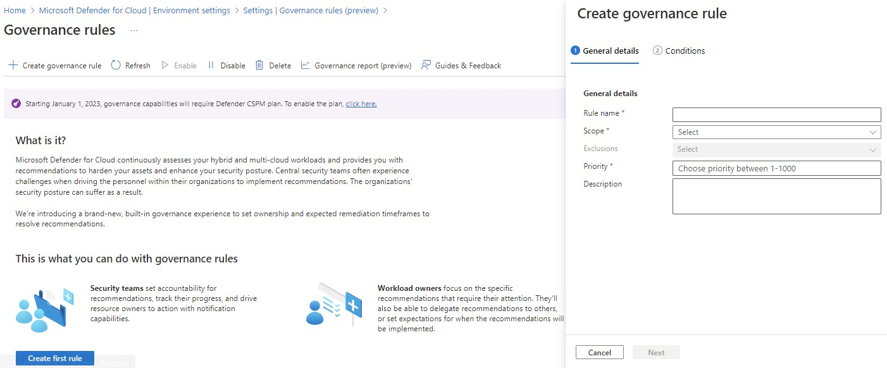
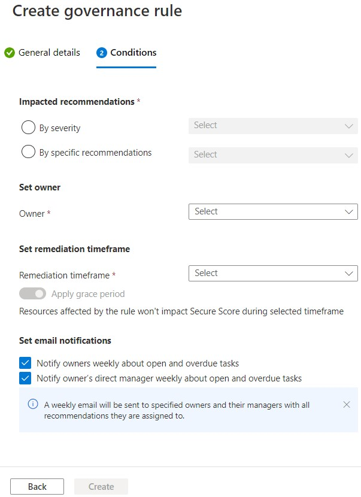
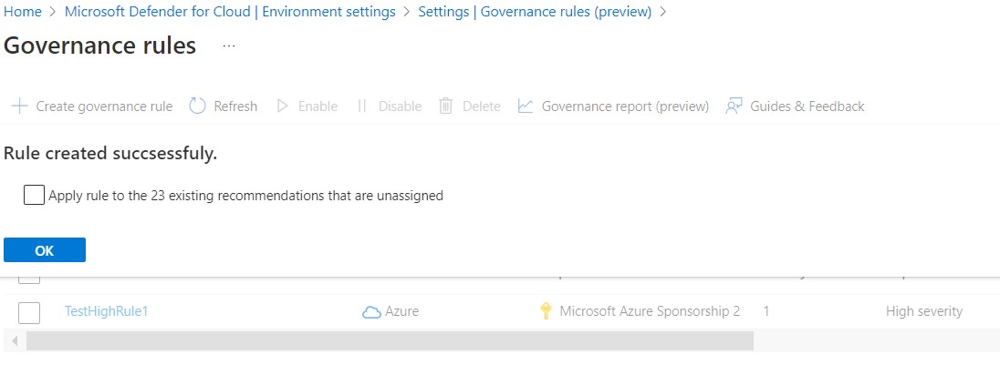
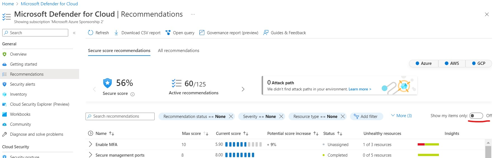

# Microsoft Defender for Cloud (MDC) Lab Exercises

# Governance
## Governance Exercise 1: Add a new Governance Rule in Microsoft Defender for Cloud 

To add a new governance rule for your recommendations, you need to go to the Governance rules on a specific subscription or AWS cloud account:

1. Sign in to the **Azure portal**.
2. Navigate to **Microsoft Defender for Cloud**, then **Environment settings**.
3. Select the relevant subscription or AWS cloud account
4. Go to **Goverance rules** on the sidebar. (it may say Governance rules (preview), if so click **Enter the new experience**.)
5. Click **+ Create governance rule** (If you have no rules yet, you'll also see **Create first rule**, which will have the same result.)
6. Fill in the following information:

Under (1) General details-

**Rule name**: High severity recommendations set to [your name]

**Scope**: Select the relevant subscription or cloud  account. 

**Exclusions**: Normally greyed out, but if you are applying at a management group, for example, you could exclude specific subscriptions within the hierarchy.

**Priority**: 1

**Description**: High severity recommendations should be remediated ASAP.

Click ***Next***

Under (2) Conditions-

Under **Impacted recommendations**- 
Select **By severity**, and choose *High*.

Under **Set owner**,

**Owner**: By email address

**Email address**: fill in your own email address

Under **Set remediation timeframe**-

**Remediation timeframe**: 14 days
Tick **Apply grace period**

Under **Set email notifications**-
Select **Notify owners weekly on open and overdue tasks**.
Unselect **Notify owner's direct manager weekly about open and overdue tasks**

Select **Create**

Now all your high severity recommendations in Microsoft defender for Cloud will have you as the owner, and you'll have 14 days from when they go unhealthy before Secure Score is affected.

You will most likely get a popup that says **Rule created successfuly** with an option to Apply the rule to existing unassigned recommendations. Feel free to do so for the lab and click **OK**.

## Governance Exercise 2: See recommendations that you're the owner of
 
1.	Navigate to **Microsoft Defender for Cloud**, then **Recommendations**.
2. Click **Show my items only** which is found on the top right corner of the recommendations table.
3. Select one of the recommendations that you own
4. Remediate it.

## Governance Exercise 3: Create a new rule for specific recommendations and set a different member of your team as the owner.
 
 Exactly the same as [Exercise 1](#governance-exercise-1-add-a-new-governance-rule-in-microsoft-defender-for-cloud), but change the details and conditions.
 
