# Microsoft Defender for Cloud (MDC) Lab Exercises

# Regulatory Compliance
We'll start with configuring regulatory compliance for Azure.

## Regulatory Compliance Exercise 1: Understanding the Regulatory Compliance dashboard

1.	From **Microsoft Defender for Cloud main dashboard**, select **Regulatory Compliance** underneath **Cloud Security**.
2.	The Regulatory Compliance dashboard opens. On this page, you can see the compliance standards currently assigned to your subscription.
3.	On the top strip, notice the number of **passed controls** for Microsoft cloud security benchmark.

## Regulatory Compliance Exercise 2: Adding new standards

You can add additional industry standards (represented as compliance packages) such as NIST SP 800-53 R4, SWIFT CSP CSCF-v2020, UK Official and more.

1.	From the top menu bar in Regulatory Compliance, select **Manage compliance policies**.
2.	Select a scope to assign the new package by choosing the relevant Azure subscription, AWS Account, or GCP project. we will start with one of your Azure subscriptions. Click the subscription
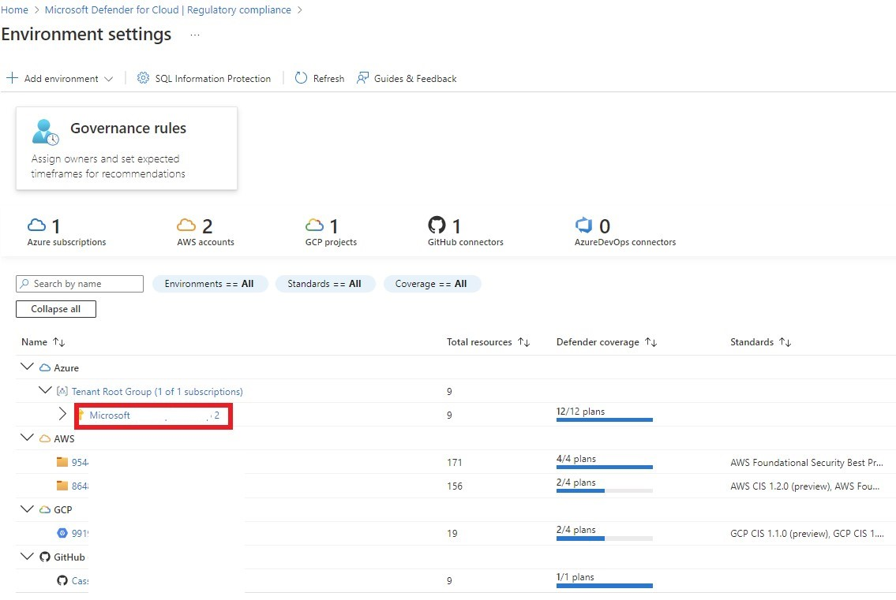
3. At the next screen, select **Security policy** under **Policy settings** on the left.
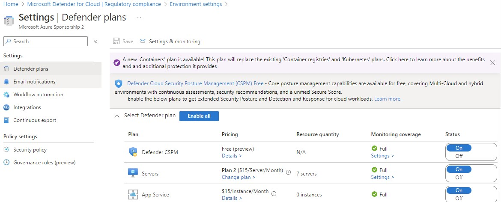
4.	Scroll down to the **Industry & regulatory standards** section, notice the out of the box standards. Click on **Add more standards**.
5.	On the **Add regulatory compliance standards**, locate the **Azure CIS 1.3.0** standard and select **Add**.
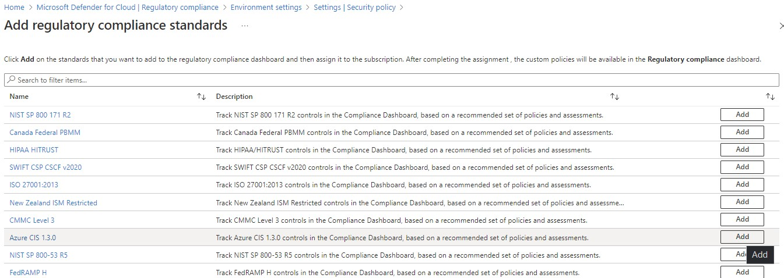
6.	Click **Assign the Policy**. For scope, select your Azure subscription, enter a Description, and leave all other options as default. Feel free to look through the other sections and discuss when you may wish to alter.
7.	Click **Review + create** and then **Create**.
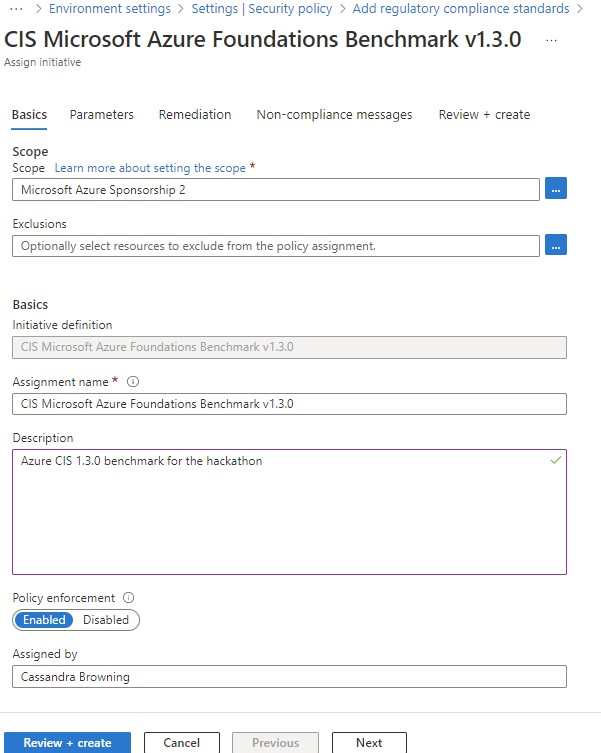

> : Important: <br>
> It will take a while until the change takes an effect (from 30 minutes to 3 hours).

8.	**Azure CIS 1.3.0** should now be listed on the standards list and will also show up in the recommendations blade, just not used for secure score calculations
   
## Regulatory Compliance Exercise 3: Exploring a benchmark 

1. From the **regulatory compliance** page, select **Microsoft cloud security benchmark**. Notice the different compliance controls mapped to assessments.
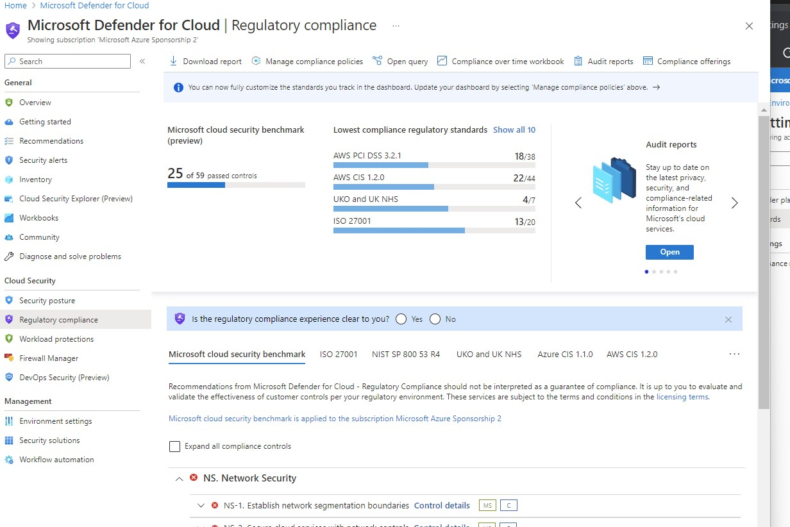

2.	Click to open up **IM.Identity Management**
3.	Click to open **IM-2. Protect identity and authentication sytem**
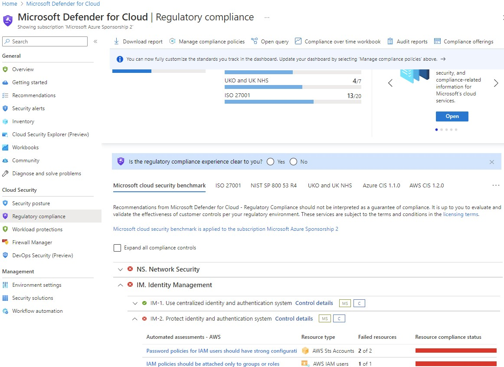
5.	Click to open **Secure transfer to storage accounts should be enabled.**
6.	Explore the recommendations.
8.	Return to the dashboard. You can export regulatory standard compliance status as a PDF report or CSV file. From the top menu bar, select Download report.
9.	On the Report standard dropdown menu, select **Microsoft cloud secrurity benchmark** and **PDF**. Click **Download**
10. A local PDF file is now stored on your machine. Open the **Microsoft cloud security benchmark Compliance Report** and explore the compliance report - This report summarizes the status of those assessments on your environment, as they map to the associated controls.
11. Download the report again, and this time change the format to CSV. Choose the relevant scope of subscription(s) and cloud account(s), along with recommendation status. The more options you select, the longer the report will be, so try a single subscription for **Scope** and Unhealthy for **Recommendation Status**. Click **Download**
11. A CSV is now on your machine, open it up and notice that it is very detailed.

## Regulatory Compliance Exercise 4: Creating your own benchmark!

Once you create your custom initiative, Microsoft Defender for Cloud allows you to add it as security policy and which provides two main benefits:
* Having security requirements represent as custom recommendations under the recommendation list.
* Having a way to track compliance status using regulatory compliance dashboard.

Navigate back to the environment settings for your Azure subscription, as you did for the earlier regulatory compliance exercise.

1.	From the left pane, select **Security policy** under **Policy settings** and scroll down to the bottom. Click **Add a custom initiative**
2.	From the top menu, select **+ Create new** to create a new policy set definition.
3.	On the Basics tab, select **Initiative location**. The recommended approach is to select management groups if they have been assigned but in our scenario select your Azure subscription as the scope.
4.	Select a name, for example: **Custom Benchmark**.
5.	Provide an informative description so others can be clear on what is the purpose of this new security policy.
6.	Select **Category**. You can decide to use existing one (for example: Regulatory Compliance) or to create your own one. *The recommended approach is to use a custom one so you can quickly filter policy definitions and initiatives when needed (for example: Contoso)*.
7.	Select **Version** number. Each policy definition and initiative contain a version in its metadata section. You can decide to have major versions (1.0), minor version (1.1) and so.  Click **Next**.
8.	Click **Controls**, to define your groups and subgroups to be used in your initiative. To add a new control group, click **Create control**.
9.	Create a new control group, for this example we will call **Control Group 1**, select a control Domain, **Sub-group1** and provide a description. Please be aware of the additional metadata which can be used as well. The location of the policyMetadata object that has additional details about the control and compliance domain. Click **Save** to create the new group.
10.	Repeat the previous step to create additional group, for example: Control Group 2
11.	Now you should have two groups to help you organize your policies within the initiative.
12.	Click on the **Policies** tab. Here you can add policy definitions, both built-in and custom. Click Add policy definition(s). Select your desired polices, if you create a benchmark, you can also leverage existing policy definitions from the **Microsoft managed** tab. For example, you can choose the following policies and select **Add**:
    -	Audit virtual machines without disaster recovery configured
    -	Audit VMs that do not use managed disks
13.	Each policy on the list, has its definition name, reference ID and the associated group. However, you do need to define a group for each policy. To do so, click on the **...** on  the far right of the row to open the context menu and select **Edit Controls**.
14.	Make sure all policies are associated to a group. Please notice that policies can be associated to multiple groups.
15.	You can assign policy and initiative parameters to be used during the assignment process. Skip this section and click on **Review + Create** to validate your settings. Then, click on Create.
16.	You should now see your new initiative listed - **Custom Benchmark** along with description, and status. You can even Add it straight from here.
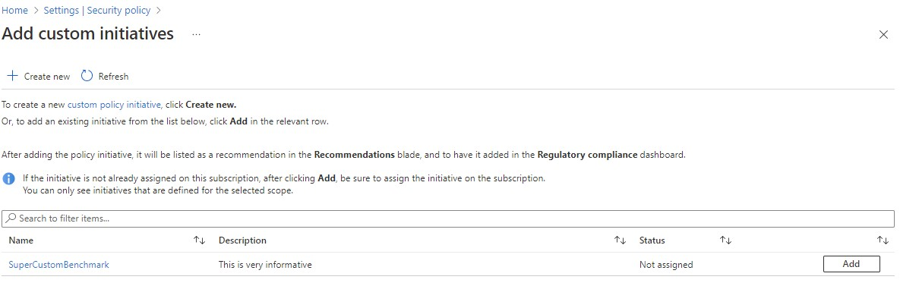
17.	Click **Add**, and check the scope on the next screen, make sure your Azure subscription is selected. Leave everything else default, **Review + Create** and **Create** again.
18 Now it will show up under *Your Custom Initiatives*, and your new security benchmark is displayed in regulatory compliance along with the built-in regulatory standards. It could take from 30 minutes to 3 hours to show up, however.

## Regulatory Compliance Exercise 4: Compliance over time workbook
For this, we'll refer you back to the official github lab page.

[Tracking compliance over time](https://github.com/Azure/Microsoft-Defender-for-Cloud/blob/main/Labs/Modules/Module-4-Regulatory-Compliance.md#exercise-6-continuous-export--compliance-over-time-workbook)


## Regulatory Compliance Exercise 5: Regulatory Compliance for AWS
The terminology is slightly different, as is the interface, from the Azure side as it is not literally using Azure policy.

In Azure, an Initiative is used to group a set of policies. However, for AWS (and GCP), a Standard is a collection of Assessments. There is still an assignment scope, but the scope will be an AWS account, for example.

Just like on the Azure side, you can use a built-in Standard, or create your own.

To assign a built-in regulatory compliance standard or a custom standard that has already been created:
1. Navigate to **Environment settings** under **Management** in Microsoft Defender for Cloud
2. Select the relevant account
3. Select **Standards** under **Settings**
4. Select **+ Create** and select **Standard**
5. Select **Existing standard**, and in the selector for **Standard** choose which standard you wish to assign. The options you see here will be standards which have not already been assigned to the cloud account. If you are using an AWS management account here, you can exclude member accounts with the second option **Select member accounts to exclude**, otherwise it will say 0 selected and there will be *No available items.*
6. Select **Save**
7. The standard will not immediately show as Assigned and could take from 30 minutes to 3 hours.

There is another way to apply Standards which have been created
1. Navigate to **Environment settings** under **Management** in Microsoft Defender for Cloud
2. Select the relevant account
3. On the right of a specific standard's row, select the ***...*** and select **Assign standard**
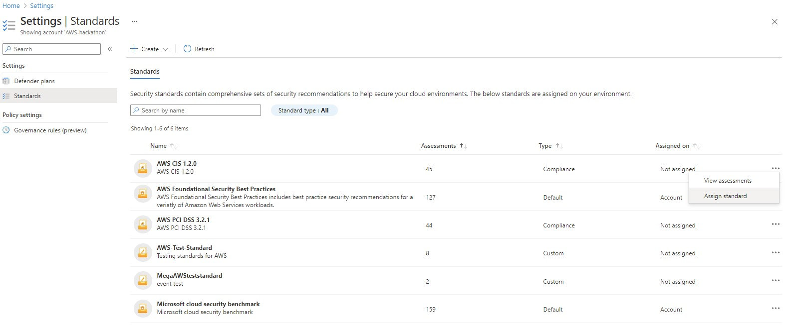
4. A popup window will appear asking if you are sure you want to assign the standard, click **Yes**
5. The standard will not immediately show as Assigned and could take from 30 minutes to 3 hours.

To create a new custom standard:
1. Navigate to **Environment settings** under **Management** in Microsoft Defender for Cloud
2. Select the relevant account
3. Select **Standards** under **Settings**
4. Select **+ Create** and select **Standard**
5. Select **New standard**
6. Fill in a name and description, and select the assessment(s) you want to be included in this standard
7. Select **Save**
8. The standard will not immediately show as Assigned and could take from 30 minutes to 3 hours.

You can also look at which assessments are used by each standard
1. Navigate to **Environment settings** under **Management** in Microsoft Defender for Cloud
2. Select the relevant account
3. On the right of a specific standard's row, select the ***...*** and select **View assessments**. *Note that you can unassign a standard here as well.*
4. You can view the individual assessments and search if there is a large number. Each assessment also has **...** on the far right with options to **Remove** for custom standards and **Manage exemptions** if you have created an exemption at some point in the past for this assessment.

# Governance
## Governance Exercise 1: Add a new Governance Rule in Microsoft Defender for Cloud 

To add a new governance rule for your recommendations, you need to go to the Governance rules on a specific subscription or AWS cloud account:

1. Sign in to the **Azure portal**.
2. Navigate to **Microsoft Defender for Cloud**, then **Environment settings**.
3. Select the relevant subscription or AWS cloud account
4. Go to **Goverance rules** on the sidebar. (it may say Governance rules (preview), if so click **Enter the new experience**.)
5. Click **+ Create governance rule** (If you have no rules yet, you'll also see **Create first rule**, which will have the same result.)
6. Fill in the following information:

Under (1) General details-

**Rule name**: High severity recommendations set to [your name]

**Scope**: Select the relevant subscription or cloud  account. 

**Exclusions**: Normally greyed out, but if you are applying at a management group, for example, you could exclude specific subscriptions within the hierarchy.

**Priority**: 1

**Description**: High severity recommendations should be remediated ASAP.

Click ***Next***


Under (2) Conditions-

Under **Impacted recommendations**- 
Select **By severity**, and choose *High*.

Under **Set owner**,

**Owner**: By email address

**Email address**: fill in your own email address

Under **Set remediation timeframe**-

**Remediation timeframe**: 14 days
Tick **Apply grace period**

Under **Set email notifications**-
Select **Notify owners weekly on open and overdue tasks**.
Unselect **Notify owner's direct manager weekly about open and overdue tasks**

Select **Create**


Now all your high severity recommendations in Microsoft defender for Cloud will have you as the owner, and you'll have 14 days from when they go unhealthy before Secure Score is affected.

You will most likely get a popup that says **Rule created successfuly** with an option to Apply the rule to existing unassigned recommendations. Feel free to do so for the lab and click **OK**.


## Governance Exercise 2: See recommendations that you're the owner of
 
1.	Navigate to **Microsoft Defender for Cloud**, then **Recommendations**.
2. Click **Show my items only** which is found on the top right corner of the recommendations table.
3. Select one of the recommendations that you own
4. Remediate it.


## Governance Exercise 3: Create a new rule for specific recommendations and set a different member of your team as the owner.
 
 Exactly the same as [Exercise 1](#governance-exercise-1-add-a-new-governance-rule-in-microsoft-defender-for-cloud), but change the details and conditions.
 

# Workflow Automation

## Isolate a machine impacted by ransomware
This workflow automation will isolate a machine using Defender for Server (Microsoft Defender for Endpoint)'s machine isolation feature. For this exercise we'll be taking action based on a mimikatz alert. This example shows the power of leveraging GitHub and not 'reinventing the wheel' unless you really need to.

1. You'll start by going to the main [Microsoft Defender for Cloud official GitHub Repository](https://github.com/Azure/Microsoft-Defender-for-Cloud) and deploying a [workflow automation playbook](https://github.com/Azure/Microsoft-Defender-for-Cloud/tree/main/Workflow%20automation) into your Azure tenant. You want to use the [Isolate-MDEATPMachineAlert automation](https://github.com/Azure/Microsoft-Defender-for-Cloud/tree/main/Workflow%20automation/Isolate-MDATPMachineAlert)
2. Click **Deploy to Azure**
3. You may be prompted to select an account, so use the same account you've been using throughout this lab. However, if you are using PIM, please elevant first as you need rights to create the automation playbook, a logic app, and the relevant API connections. Log in with your selected account.
4. At subsequent **Custom deployment** screen, select the appropriate subscription, region, potentially change the playbook name, and add your email address.
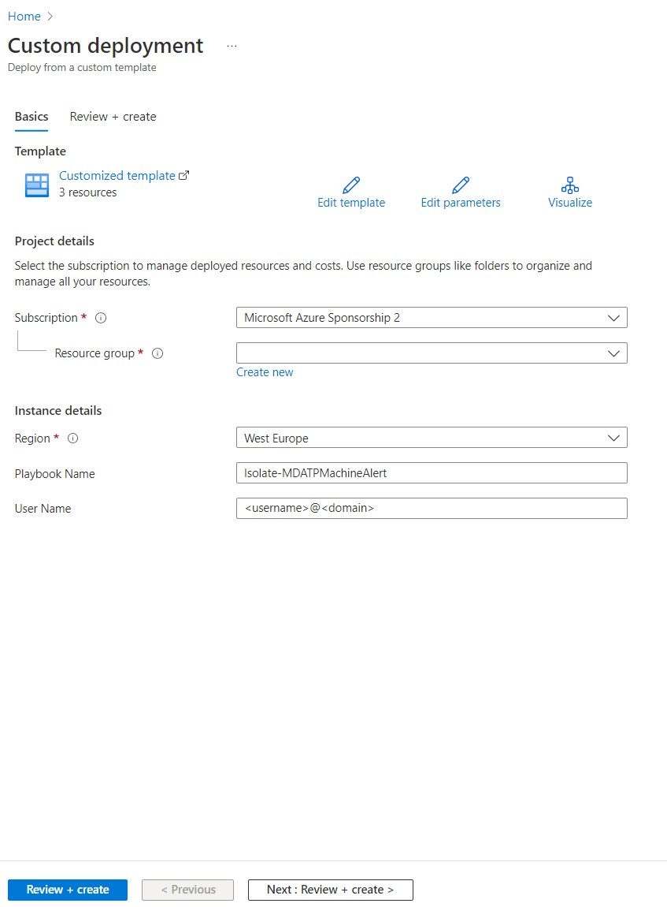
5. Select **Review + create**, and **Create** and wait for your deployment to complete.
6. Return to Microsoft Defender for Cloud in the portal, and select **Workflow automation** under **Management**
7. Select **+Add Workflow automation**
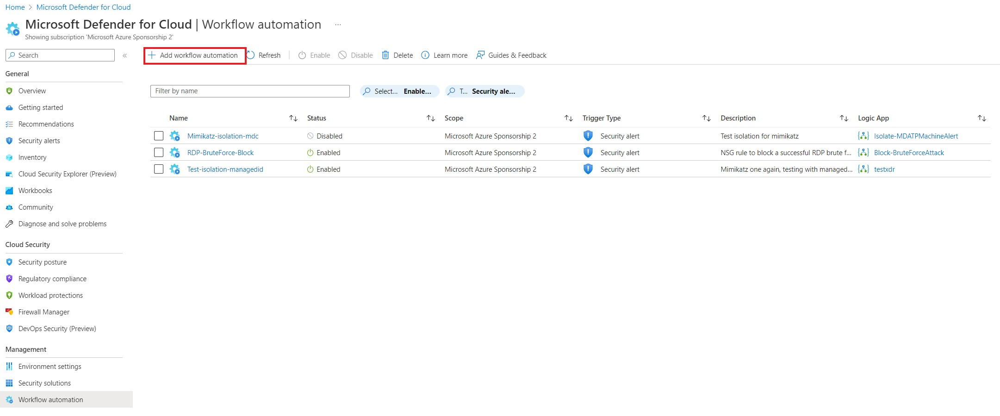
8. Choose a unique name, give it a useful description, choose the relevant subscription and resource group, Defender for Cloud data type should be Security alert, and enter *Mimikatz credential theft tool* in Alert name contains. Select High severity, and under Actions, find the logic app that was created when you added the custom deployment from GitHub earlier.
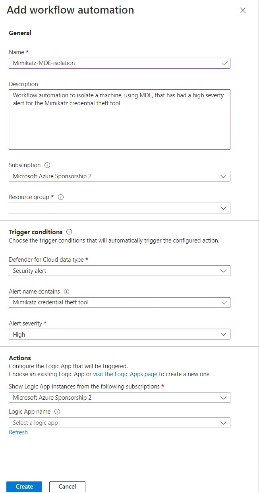
9. Select **Create**
10. You now need to take a look at the logic app that was deployed earlier, and finish configuring it for your environment. Go to **Logic apps** in the Azure portal, find your new logic app (that you previously selected for your playbook), and open it.
11. Select **API connections** under **Development Tools**.
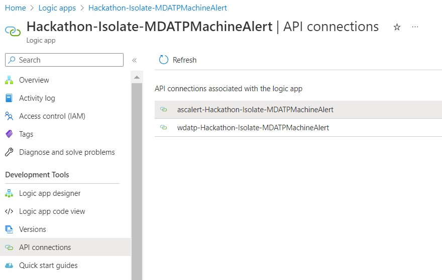
12. Open both connections and note their **Status**. Most likely the one referring to Microsoft Defender ATP has an *Error* status. Select **Edit API connection** under **General**.
13. You should have a blue selection box towards the bottom labeled **Authorize**. Click it and you should get a popup asking you to sign into your account,, a Permissions Requested box. Consent and Accept - it is connecting to the API.
14. It should return to the prior screen where you'll see Authorize successful. Click **Save** 
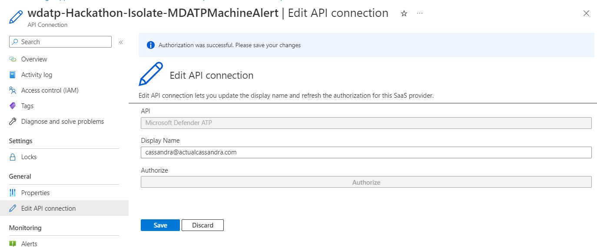
The button will stay blue, but that's fine, go back to look at the API connection and you should now see the Status as Connected.
15. That's it! You can test this automation playbook out by going into your virtual machine and attempting to download Mimikatz - please use the GitHub that will show up on an internet search. You will probably have to download multiple times and tell Windows smartscreen to keep the file anyway. When the alert appears, the logic app will be triggered and you should lose your network connection to the virtual machine.
16. Find the machine in the security.microsoft.com portal under devices and select **Release from isolation** at the top right and you should be able to connect again.

 [](#stretch-goals)

**We can improve this logic app!** Earlier when it asked you to log in to the API - there are better ways such a using a managed identity. 

1. Go back to your logic app, and select **Identity** under **Settings**
2. Change System-Assigned to **On**
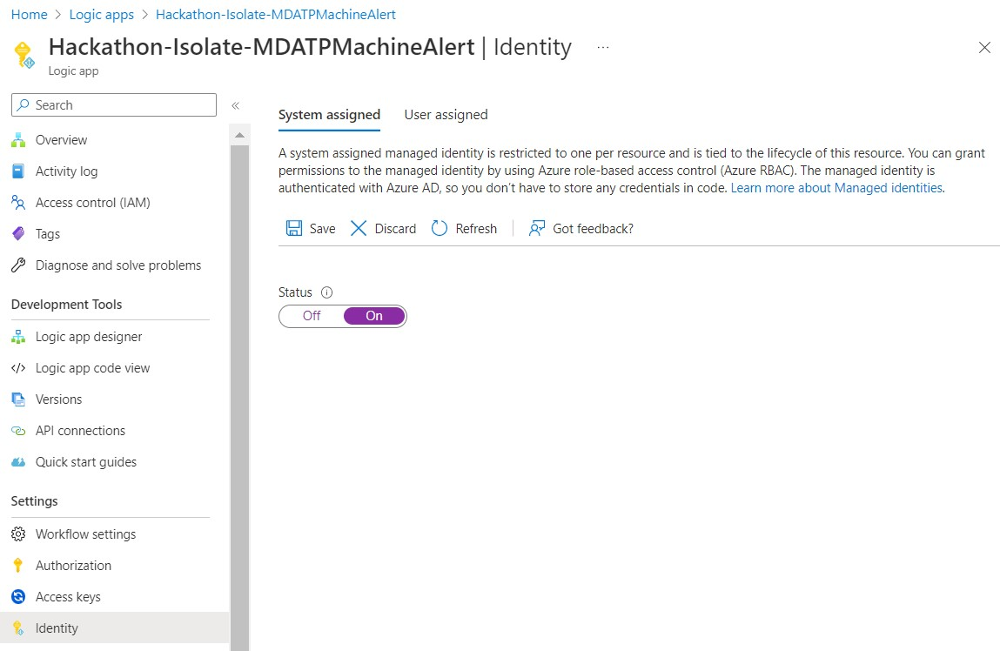
3. Select **Yes** at the next confirmation prompt.
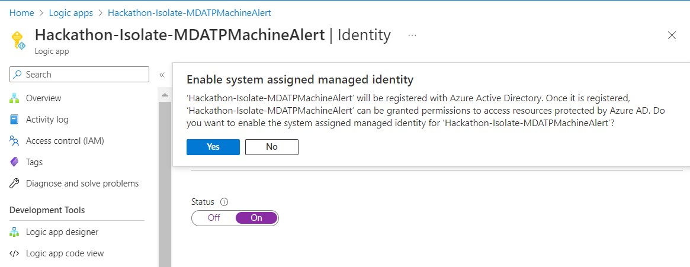
4. Take note of the Object(principal) ID, as you'll need that for commands we'll run in cloud shell shortly.
5. Under **Permissions** on the same screen, click **Azure role assignments**
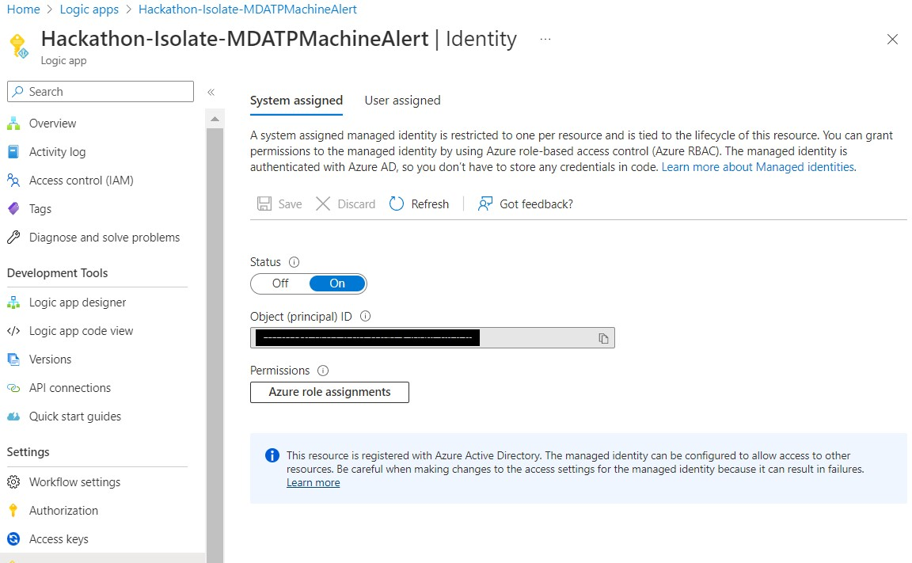
6. Add a role assignment at the next screen - *Microsoft Sentinel Responder*.
7. We now need to grant Machine.Isolate permissions to the managed identity. Run the following command in the PowerShell Azure cloud shell. If you are curious about MDEAppID, take a look at your Enterprise Applications in the Azure Portal.

```
Connect-AzureAD

$MIGuid = "enter the managed identity id here"
$MI = Get-AzureADServicePrincipal -ObjectId $MIGui
$MDEAppId = "fc780465-2017-40d4-a0c5-307022471b92"
$PermissionName = "Machine.Isolate"
$MDEServicePrincipal = Get-AzureADServicePrincipal -Filter "appId eq '$MDEAppId'"
$AppRole = $MDEServicePrincipal.AppRoles | Where-Object {$_.Value -eq $PermissionName -and $_.AllowedMemberTypes -contains "Application"}
New-AzureAdServiceAppRoleAssignment -ObjectId $MI.ObjectId -PrincipalId $MI.ObjectId `
-ResourceId $MDEServicePrincipal.ObjectId -Id $AppRole.Id
```
8. The commands should run and you'll see some green output including ObjectId, ResourceDisplayName, and PrincipalDisplayName
9. Now go back to your logic app, select **Logic App Designer** under **Development Tools**. Look for the step *For Each* and expand it until you see an option to change the connection. Click **Change connection**
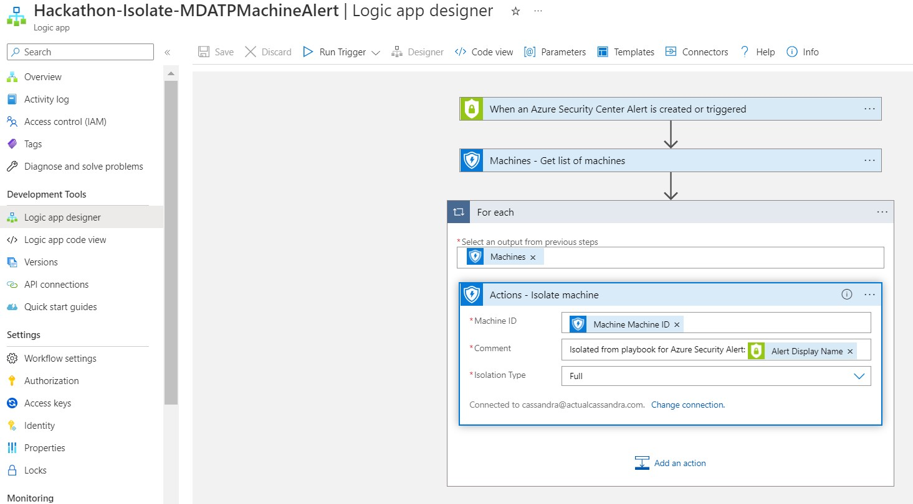
10. Select **Add New** and then **Connect with managed identity**, make sure the correct tenant is chosen, it is showing system-assigned managed identity, and give it a name. Click **Create**
11. It should now show as Connected to the name you just gave it. 
12. Click **Save* at the top and wait for the action to complete. 
13. You're now using a managed identity to connect to the API!
